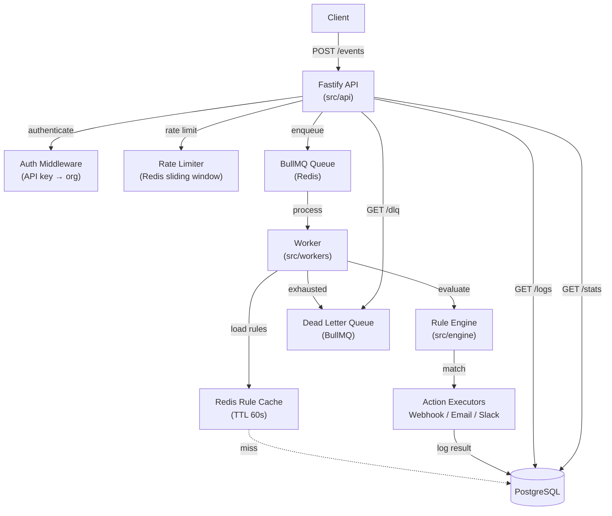

# Triggrr

**Multi-Tenant Event Automation & Notification Engine**

Triggrr lets you define rules that watch for incoming events and automatically fire actions — webhooks, emails, or Slack messages — whenever conditions are met. Multiple organisations share one deployment; each tenant is isolated by API key.

---

## What It Does

1. **Ingest events** via `POST /events` (e.g. `user.signed_up`, `payment.failed`)
2. **Evaluate rules** — each rule specifies an `event_type`, a condition (field + operator + value), and an action
3. **Execute actions** — webhook POST, email via SMTP, or Slack incoming webhook
4. **Observe results** — paginated logs, aggregate stats, per-rule history

---

## Architecture



---

## Tech Stack

| Layer | Technology |
|---|---|
| HTTP Framework | [Fastify v5](https://fastify.dev) |
| Validation | [Zod v4](https://zod.dev) |
| Queue | [BullMQ](https://docs.bullmq.io) |
| Cache / Rate Limiting | [ioredis](https://github.com/redis/ioredis) |
| Database | PostgreSQL 15 via [node-postgres](https://node-postgres.com) |
| Email | [Nodemailer](https://nodemailer.com) |
| Logging | [Pino](https://getpino.io) |
| Language | TypeScript 5, Node.js 20 |
| API Docs | [@fastify/swagger](https://github.com/fastify/fastify-swagger) + Swagger UI |

---

## Run Locally

### Prerequisites

- Node.js ≥ 20
- Docker & Docker Compose

### 1. Clone & install

```bash
git clone https://github.com/your-org/triggrr.git
cd triggrr
npm install
```

### 2. Configure environment

```bash
cp .env.example .env
# The defaults in .env.example work with docker-compose postgres/redis
```

### 3. Start infrastructure

```bash
docker compose up postgres redis -d
```

### 4. Run migrations

```bash
npm run migrate
```

### 5. Start the API

```bash
npm run dev
# → http://localhost:3000
# → Swagger UI: http://localhost:3000/docs
```

### 6. Start the Worker (separate terminal)

```bash
npm run dev:worker
```

### 7. Run the demo

```bash
./scripts/demo.sh
```

### 8. Run tests

```bash
npm test
```

### Full Docker stack

```bash
docker compose up --build
```

---

## API Overview

> All endpoints except `/health` and `/auth/register` require `x-api-key: <your-key>` header.

| Method | Path | Description |
|--------|------|-------------|
| `GET` | `/health` | Liveness check |
| `POST` | `/auth/register` | Register org, receive API key |
| `POST` | `/events` | Ingest an event (rate limited) |
| `POST` | `/rules` | Create a rule |
| `GET` | `/rules` | List rules (with `last_triggered_at`) |
| `PATCH` | `/rules/:id` | Update rule name / condition / config / active flag |
| `DELETE` | `/rules/:id` | Soft-delete (deactivate) a rule |
| `GET` | `/rules/:id/logs` | Last 50 action logs for a rule |
| `GET` | `/logs` | Paginated action log list (filter by status, rule) |
| `GET` | `/stats` | Aggregate stats: totals, success rate, top 5 rules |
| `GET` | `/dlq` | List dead-letter queue entries |
| `POST` | `/dlq/:job_id/retry` | Re-queue an exhausted job |
| `GET` | `/docs` | Swagger UI |

Full interactive docs: `http://localhost:3000/docs`

---

## Environment Variables

| Variable | Required | Default | Description |
|----------|----------|---------|-------------|
| `PORT` | No | `3000` | HTTP port |
| `NODE_ENV` | No | `development` | `development` or `production` |
| `DATABASE_URL` | **Yes** | — | PostgreSQL connection string |
| `REDIS_URL` | **Yes** | — | Redis connection string |
| `API_KEY_SECRET` | **Yes** | — | HMAC secret for API key signing (32+ chars) |
| `LOG_LEVEL` | No | `info` | Pino log level |
| `WORKER_CONCURRENCY` | No | `5` | BullMQ worker concurrency |
| `SMTP_HOST` | No | — | SMTP host (email actions only) |
| `SMTP_PORT` | No | — | SMTP port |
| `SMTP_USER` | No | — | SMTP username |
| `SMTP_PASS` | No | — | SMTP password |
| `SMTP_FROM` | No | — | From address for outgoing email |

---

## Project Structure

```
src/
├── api/              # Fastify app factory + plugin registration
├── cache/            # Redis rule cache (TTL 60s)
├── config/           # App config + plan limits
├── db/               # DB client + migrations
├── engine/           # Rule evaluator + action executors
│   └── executors/    # webhook, email, slack
├── middleware/        # Auth + rate limiter
├── queue/            # BullMQ queue + DLQ
├── resources/        # MVC resources
│   ├── auth/
│   ├── action-logs/
│   ├── dlq/
│   ├── events/
│   ├── health/
│   ├── logs/         # New in Phase 6: logs + stats
│   └── rules/
├── shared/           # DB + Redis client + utilities
├── utils/            # Logger
└── workers/          # BullMQ worker

docs/
├── deploy.md                       # Fly.io + Neon + Upstash deployment guide
├── triggrr.postman_collection.json # Postman collection
└── triggrr.postman_environment.json

scripts/
└── demo.sh                         # End-to-end curl demo
```

---

## Deploy to Fly.io

See [`docs/deploy.md`](docs/deploy.md) for the full step-by-step guide.

Quick summary:

```bash
fly apps create triggrr-api
fly secrets set DATABASE_URL="..." REDIS_URL="..." API_KEY_SECRET="..."
fly deploy
```

---

## Plans & Limits

| Plan | Requests/min | Max rules |
|------|-------------|-----------|
| `free` | 100 | 10 |
| `pro` | 1,000 | 100 |
| `enterprise` | 10,000 | 1,000 |

---

## License

MIT
